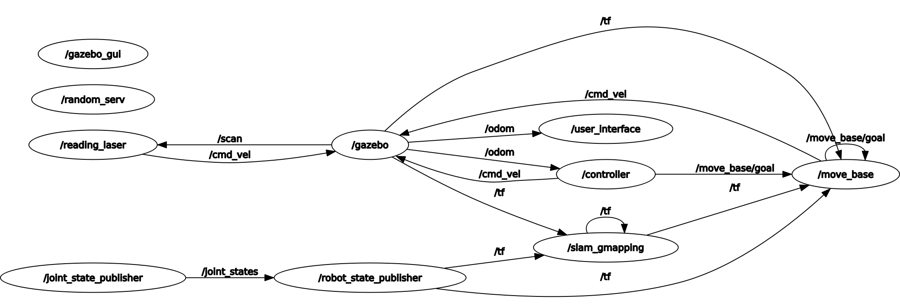

# Research Track I - second assignment

###### Maria Luisa Aiachini 4375373

### Description
Ths assignment consisted in developing a software architecture for the control of a mobile robot.
The arcitecture consisted in getting the user request and make the robot execute one of the four possible behaviours based on the user input:
- moving randomly in the environment by choosing 1 out of 6 possible target positions: (-4,-3);(-4,2);(-4,7);(5,-7);(5,-3);(5,1)
- asking the user for the next target position (checking that the position is one of the possible six)
- start following the walls
- stop in the last position

The final_assignment package contains four nodes: user interface, controller, random_serv and wall_follow_service_m

### Nodes description
- The first node, user_interface, is the node for explaining the modalities to the user and to ask to choose the one to start with. It contains a subscriber to the /odom topic for retreiving the robot position and, when the user choose the modality it sets the parameter 'state'.

- The second node, random_serv, is a server of the service 'random_pos' of type "random_targ", it is used to compute a random integer number between 1 and 6. It receives as a request the numbers to generate a number in between and gives as a response the x and y coordinates for the target. Every number corresponds to a target position:
	1-> (-4,3), 2-> (-4,2), 3-> (-4,7), 4-> (5,-7), 5-> (5,-3), 6-> (5,1)

- The third node, wall_follow_service_m, is the node used for making the robot follow the walls, it is a service called 'wall_follower_switch" of type "SetBool", it reads the output from the laser scan (subscriber of the topic /scan) and uses it for changing the states of a finite state machine: find wall, turn left and follow the walls. Inside the functions for every state the velocities, linear and angular, are set and then published on the topic /cmd_vel

- The fourth node, controller, is used for controlling the behaviour of the robot, it takes the first action by getting the parameter "state" set in the user interface. There are four functions for every possible modality of the robot, and a function for updating the state when possible: it takes an input from the user and calls the respective function.
This node contains: a subscriber to the topic /odom for the robot position; two publishers: one for setting the goal (move_base/goal) and one for manually setting the velocities (cmd_vel); two clients: one for the random position (random_pos) and one for the wall follow mode (/wall_follower_switch)

#### functions:
  - Function for random position: it calls the random position service and gets the target position as the response. Also, it prints the distance of the robot from the target. When the target is reached the function for changing modality is called and the user can change it or simply call again the same.
  - Function for choosing a manual positon: It asks the user a target between the six possible options. Here again the distance from the target is printed and, once the target is reached the user can change modality.
  - Function for following the walls: calls the wall_follower_switch and the wall_follow_service node. In this case the user have the possibility to change the modality, or stop the robot at every moment.
  - Function for stopping the robot in current position. It can be called after the "target reached" in the manual and random modality or at everty moment during the wall_follow mode. Also in this case the user can change modality at every time.

The package contains also the service random_targ
```
float32 min
float32 max
---
float32 x
float32 y
```
which contains minimum and maximum possible values of the target as a request and x and y position of the new target as a response.


### Graph of the system


### Instructions
For this project two packages are needed, and can be downloaded or cloned from:

https://github.com/Marilwoo/RT1_FinalAssignment.git

After building the packages, the simulator and the nodes can be launched by executing in four terminals the commands:
```
roslaunch final_assingment simulation_gmapping.launch
roslaunch final_assignment move_base.launch
rosrun final_assignment wall_follow_service_m.py
roslaunch final_assignment interface.launch
```


